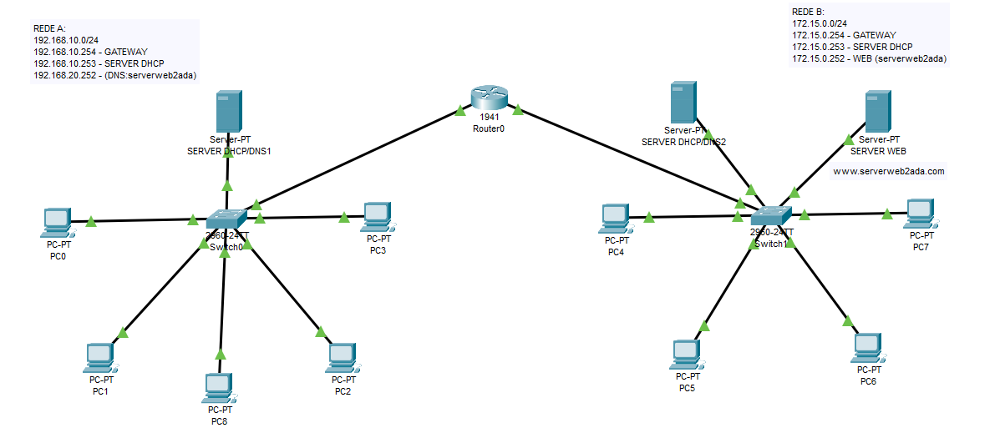

# Configuração da Rede

## Servidores

### SERVER DHCP/DNS1

- **IPv4 Address:** 192.168.10.253
- **Subnet Mask:** 255.255.255.0
- **Gateway:** 192.168.10.254
- **DNS Server:** 172.15.0.252

### SERVER DHCP/DNS2

- **IPv4 Address:** 172.15.0.253
- **Subnet Mask:** 255.255.255.0
- **Gateway:** 172.15.0.254
- **DNS Server:** 172.15.0.252

### SERVER WEB

- **IPv4 Address:** 172.15.0.252
- **Subnet Mask:** 255.255.255.0
- **Gateway:** 172.15.0.254
- **DNS Server:** 172.15.0.252

## PCs

### PC-0

- **Origem:** SERVER DHCP/DNS1
- **IPv4 Address:** 192.168.10.253

### PC-1

- **Origem:** SERVER DHCP/DNS1
- **IPv4 Address:** 192.168.10.253

### PC-2

- **Origem:** SERVER DHCP/DNS1
- **IPv4 Address:** 192.168.10.253

### PC-3

- **Origem:** SERVER DHCP/DNS1
- **IPv4 Address:** 192.168.10.253

### PC-4

- **Origem:** SERVER DHCP/DNS2
- **IPv4 Address:** 172.15.0.253

### PC-5

- **Origem:** SERVER DHCP/DNS2
- **IPv4 Address:** 172.15.0.253

### PC-6

- **Origem:** SERVER DHCP/DNS2
- **IPv4 Address:** 172.15.0.253

### PC-7

- **Origem:** SERVER DHCP/DNS2
- **IPv4 Address:** 172.15.0.253

### PC-8

- **Origem:** SERVER DHCP/DNS1
- **IPv4 Address:** 192.168.10.253

## Roteadores

### Router0

- **Gigabit Ethernet 0/0:**
  - **IPv4 Address:** 192.168.10.254
  - **Subnet Mask:** 255.255.255.0

- **Gigabit Ethernet 0/1:**
  - **IPv4 Address:** 172.15.0.254
  - **Subnet Mask:** 255.255.255.0

## Switches

### Switch0

- **FastEthernet0/1:** PC0
- **FastEthernet0/2:** PC1
- **FastEthernet0/3:** PC2
- **FastEthernet0/4:** PC3
- **FastEthernet0/5:** PC8
- **FastEthernet0/24:** SERVER DHCP/DNS1
- **GigabitEthernet0/1:** Router0

### Switch1

- **FastEthernet0/1:** PC4
- **FastEthernet0/2:** PC5
- **FastEthernet0/3:** PC6
- **FastEthernet0/4:** PC7
- **FastEthernet0/23:** SERVER WEB
- **FastEthernet0/24:** SERVER DHCP/DNS2
- **GigabitEthernet0/1:** Router0
